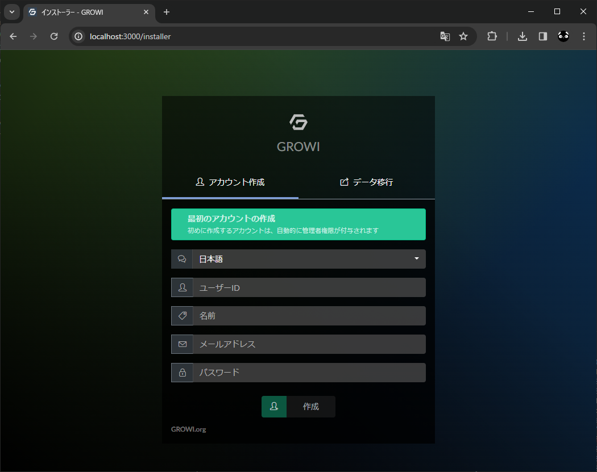
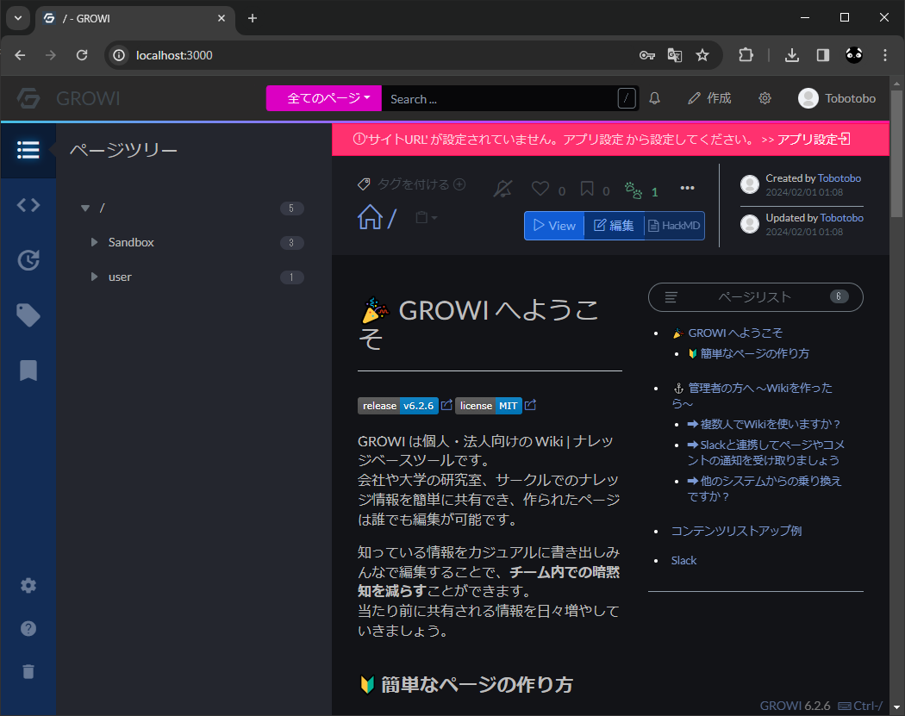

# GROWI

公式  
https://growi.org/ja/

GROWI Docs - docker-compose  
https://docs.growi.org/ja/admin-guide/getting-started/docker-compose.html#%E6%A6%82%E8%A6%81

## メモ

```
git clone https://github.com/weseek/growi-docker-compose.git growi
cd growi
docker compose up
```

えらー
```log
app-1            | 2024/01/31 15:16:28 Problem with dial: dial tcp: lookup mongo on 127.0.0.11:53: server misbehaving. Sleeping 1s
app-1            | 2024/01/31 15:16:29 Problem with dial: dial tcp: lookup mongo on 127.0.0.11:53: server misbehaving. Sleeping 1s
mongo-1          | 
mongo-1          | WARNING: MongoDB 5.0+ requires a CPU with AVX support, and your current system does not appear to have that!
mongo-1          |   see https://jira.mongodb.org/browse/SERVER-54407
mongo-1          |   see also https://www.mongodb.com/community/forums/t/mongodb-5-0-cpu-intel-g4650-compatibility/116610/2
mongo-1          |   see also https://github.com/docker-library/mongo/issues/485#issuecomment-891991814
mongo-1          | 
mongo-1 exited with code 132
app-1            | 2024/01/31 15:16:38 Timeout after 1m0s waiting on dependencies to become available: [tcp://mongo:27017 tcp://elasticsearch:9200]
app-1 exited with code 0
app-1            | 2024/01/31 15:16:39 Connected to tcp://elasticsearch:9200
app-1            | 2024/01/31 15:16:39 Problem with dial: dial tcp: lookup mongo on 127.0.0.11:53: server misbehaving. Sleeping 1s
app-1            | 2024/01/31 15:16:40 Problem with dial: dial tcp: lookup mongo on 127.0.0.11:53: server misbehaving. Sleeping 1s
```

↓AVXが有効になっていない
```
$ cat /proc/cpuinfo | grep flags
flags           : fpu vme de pse tsc msr pae mce cx8 apic sep mtrr pge mca cmov pat pse36 clflush mmx fxsr sse sse2 ht syscall nx rdtscp lm constant_tsc rep_good nopl xtopology nonstop_tsc cpuid tsc_known_freq pni 
pclmulqdq ssse3 cx16 pcid sse4_1 sse4_2 movbe popcnt aes rdrand hypervisor lahf_lm abm 3dnowprefetch invpcid_single pti fsgsbase bmi1 bmi2 invpcid rdseed clflushopt md_clear flush_l1d arch_capabilities
```

手っ取り早く `bcdedit /set hypervisorlaunchtype off` の方で対応  
※デメリットもあるので注意。詳細は下記サイト参照

WindowsでVirtualBoxとDockerを併用するときに気をつけること(AVX)  
https://qiita.com/g-iki/items/d31cd4e8d0c5f7d94991
```
bcdedit /set hypervisorlaunchtype off
```


※AVX 不要な構成に置き換えた MongoDB に置き換える方法もあるらしい  
MongoDB New Version without AVX  
https://www.nertwork.com/2023/04/15/mongodb-new-version-without-avx/


localhost 以外からのアクセスを許可  
※今の Vagrant の構成だとこれやらないと繋がらなかった
```yaml
services:
  app:
    ports:
      # - 127.0.0.1:3000:3000
      - 3000:3000
```

http://localhost:3000  
※パスワードが短すぎる場合(8文字未満？)もインストール失敗としか表示されないので注意

