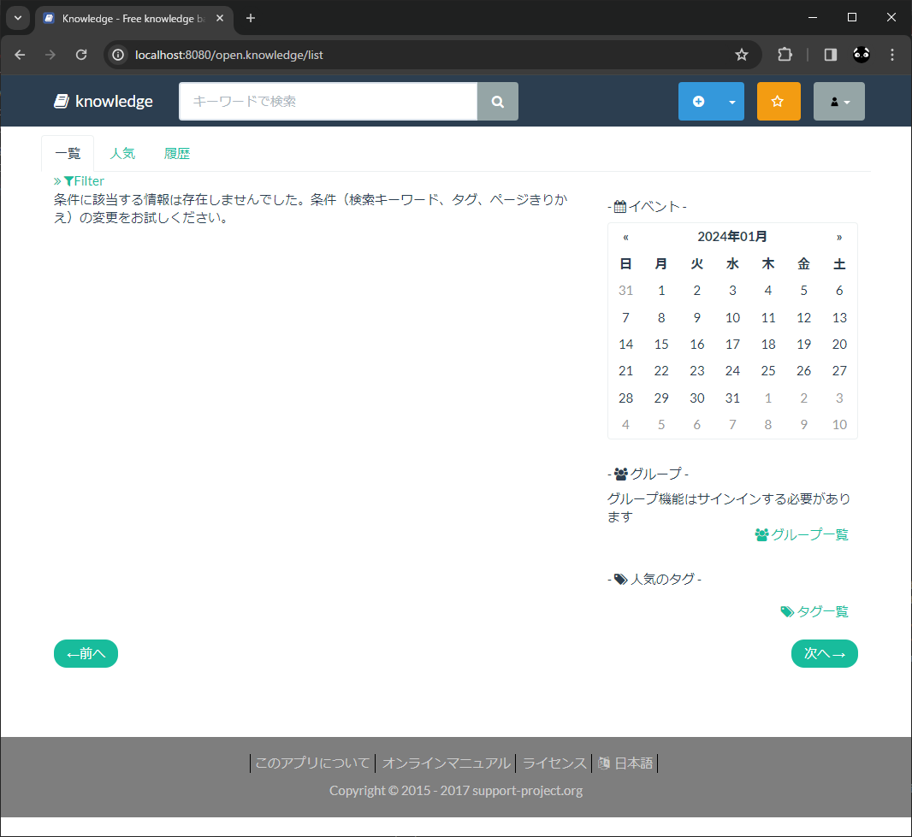

# Knowledge

公式  
https://information-knowledge.support-project.org/ja/

GitHub  
https://github.com/support-project/knowledge

↓ DockerFile を置いてくれてる  
https://github.com/support-project/docker-knowledge

## メモ
* 2018 年以降更新されていない。

なんかエラーでしんだ
```
[vagrant@localhost Knowledge]$ docker compose up
～～～～～～～～～～～～～～～～～～～～
Attaching to app-1
app-1  | library initialization failed - unable to allocate file descriptor table - out of memory
app-1 exited with code 134
```

ありがたやー

docker エラー「library initialization failed – unable to allocate file descriptor table – out of memory」が発生した場合の対処法  
https://mebee.info/2023/02/24/post-91293/
> 自分の場合は「ulimits」値を追加で記述することで改善しました。

```
version: '2'
services:
    app:
        image: koda/docker-knowledge
        #build: .
        volumes:
            - ./volumes/knowledge:/root/.knowledge
        ulimits:         ★
          nofile:　　　　★
            soft: 65536　★
            hard: 65536　★
```


起動中になんかエラー吐いててこえーな…
```
app-1  | ERROR 2024-01-20 23:55:27,845 Transaction(58) Error(Rollback) : org.support.project.web.dao.SystemsDao_$$_jvste3_0#_d50selectOnKey
```

とりあえず起動できた
